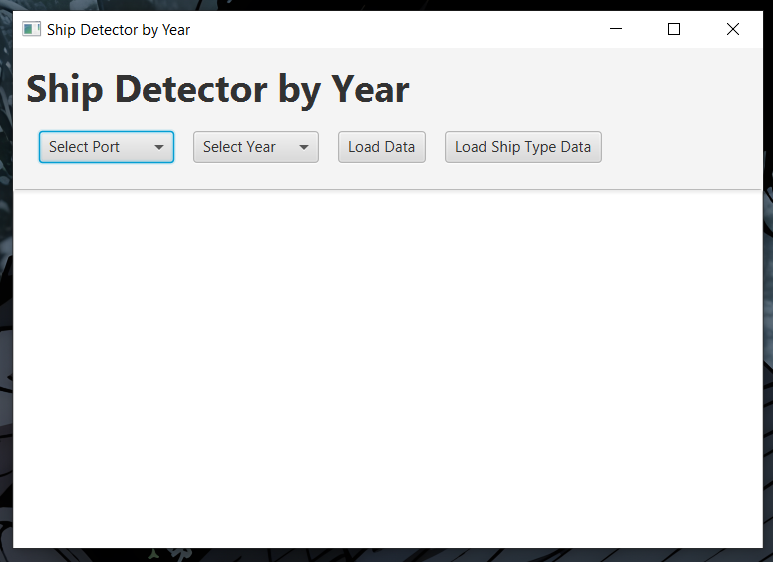
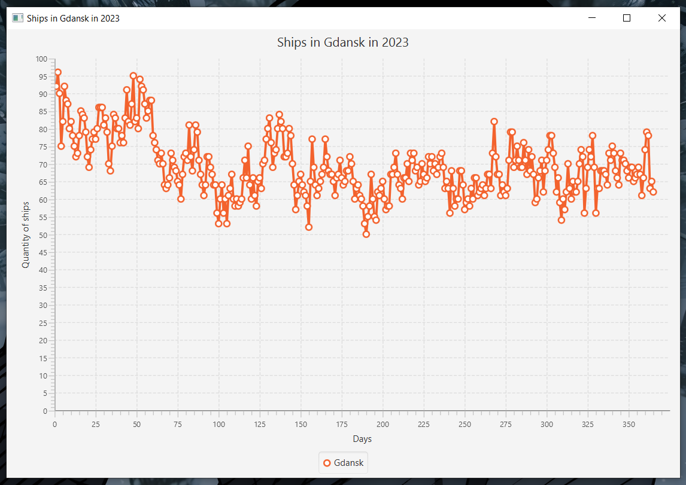
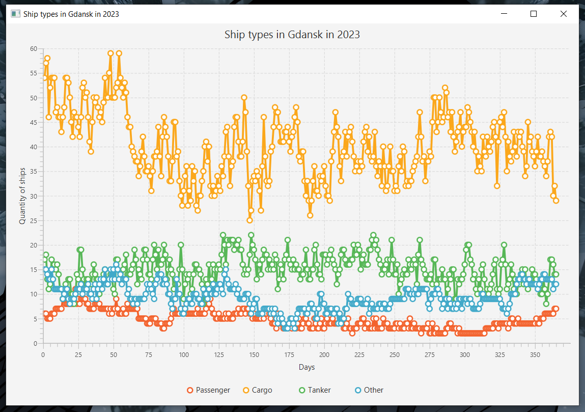

# Maritime Traffic Data Visualization Platform

[](https://maven.apache.org/)
[](https://www.oracle.com/java/)
[](https://openjfx.io/)
[](https://github.com/FasterXML/jackson)
[](https://api-transtat.stat.gov.pl/apidocs/index.html)

## 📖 Project Description

A comprehensive JavaFX-based application that retrieves, parses, and visualizes maritime traffic data from the Polish Central Statistical Office (GUS) public API. The application provides real-time insights into ship movements across major Polish ports including Gdansk, Gdynia, Szczecin, and Swinoujscie, with support for filtering by ship type and temporal range. The project demonstrates advanced Java concepts including modular architecture (JPMS), REST API integration, JSON deserialization, and interactive data visualization through line charts.

### 🛠 Technical Stack & Concepts

- **Build Automation (Maven)**: Multi-module Maven project structure ensuring platform-independent compilation and deployment. Leverages dependency management for seamless integration across distributed systems and CI/CD pipelines.
  
- **REST API Integration & Networking**: Implements HTTP/HTTPS communication with the GUS TranStat API using native Java `HttpURLConnection` and custom SSL certificate handling. Demonstrates secure network programming practices and API response parsing at scale.
  
- **Modular Project Structure (JPMS)**: Fully compliant with Java Platform Module System, featuring separate `client` and `gui` modules with explicit module declarations in `module-info.java`. Enforces strong encapsulation and clear separation of concerns between business logic and user interface layers.

---

## 🎯 The Task

Design and implement a multi-tier desktop application that consumes publicly available maritime data from the Polish Central Statistical Office API. The application must:

- **Retrieve maritime statistics** from the GUS TranStat API endpoints, including ship counts by port and vessel type
- **Parse JSON responses** containing temporal ship data across Gdansk, Gdynia, Szczecin, and Swinoujscie ports
- **Visualize data dynamically** using interactive JavaFX line charts with filtering capabilities
- **Maintain modular architecture** with separate `lab04_client` (business logic) and `lab04_gui` (presentation) JARs
- **Handle SSL/TLS communications** securely while managing certificate verification
- **Provide interactive UI controls** for port and year selection with real-time chart generation

### 🧩 Implementation Logic

The application follows a client-server architectural pattern with clear separation of layers:

1. **Data Acquisition Layer**: The `Request` class establishes HTTPS connections to the GUS API, executing parameterized queries for ship counts and type-specific statistics. Responses are deserialized into strongly-typed Java objects using Jackson ObjectMapper.

2. **Domain Model Layer**: `ShipsInPorts` and `ShipTypeInPort` POJOs represent the API response structure with automatic Jackson-binding to JSON fields (date, port counts, ship type identifiers).

3. **Presentation Layer**: The `Main` JavaFX application creates an interactive UI with ComboBox selectors for port/year filtering, Button controls for triggering data loads, and a TextArea for status output.

4. **Visualization Component**: The `Graf` class constructs dynamic `LineChart` instances, filtering temporal data by year and mapping port-specific ship counts to X-Y coordinates where X represents day-of-year and Y represents ship quantity.

5. **SSL Management (`SSLUtils`):** Provides a utility to bypass SSL certificate verification. This is strictly a **development-only** workaround to facilitate communication with the GUS API in environments where the local trust store is not fully configured. It ensures a smooth development workflow while documenting the security implications.

---

## 📥 Input Data Format

The application consumes JSON data from the GUS TranStat API in the following format:

### Ports Data Endpoint
```json
[
  {
    "id": 1001,
    "date": "2023-01-15T00:00:00",
    "gdansk": 42,
    "gdynia": 38,
    "szczecin": 25,
    "swinoujscie": 31
  },
  {
    "id": 1002,
    "date": "2023-01-16T00:00:00",
    "gdansk": 45,
    "gdynia": 40,
    "szczecin": 27,
    "swinoujscie": 33
  }
]
```

### Ship Types Data Endpoint
```json
[
  {
    "id": 2001,
    "date": "2023-01-15T00:00:00",
    "gdansk": 12,
    "gdynia": 10,
    "szczecin": 8,
    "swinoujscie": 7
  }
]
```

**Data Source**: https://api-transtat.stat.gov.pl/api/v1/C001MInd111p/?format=json  
**API Documentation**: https://api-transtat.stat.gov.pl/apidocs/index.html

---

## 🚀 How to Run

### ⚙️ Prerequisites

* Java 21 or higher
* Maven 3.8+
* JavaFX Runtime** (if not included in your JDK distribution):
  - Liberica JDK Full includes JavaFX by default
  - For other distributions, download from [openjfx.io](https://gluonhq.com/products/javafx/)
* Network Access**: Active internet connection to reach the GUS API (https://api-transtat.stat.gov.pl/)

### 🔨 Build

Because this is a multi-module project consisting of `lab04_client` and `lab04_gui`, you must install the business logic module into your local repository first so the GUI module can resolve it as a dependency:

```bash
mvn clean install
```

This command compiles source code, runs tests (if available), and packages the project into an executable JAR file.

### ▶️ Run

**Option 1: Using Maven Plugin (Recommended)**  
This is the most reliable method as it automatically handles the module path and dependencies:
```bash
mvn javafx:run -pl gui
```

**Important**: This project requires JavaFX. The easiest way to run it is using Liberica JDK Full, which includes the JavaFX runtime. If you use a standard JDK, ensure you have configured the JavaFX module-path.

**Option 2: Via IntelliJ IDEA Maven Interface**  
If mvn is not recognized in your terminal, use the built-in IDE tools:

1. Open the Maven Tool Window on the right side of the IDE.
2. Navigate to gui -> Plugins -> javafx.
3. Double-click javafx:run.


## 📋 Sample Output

### 🖥️ Main Interface
Upon launching the application, the initial GUI window appears with interactive controls. Users can select a specific Polish port and year from the dropdown menus to begin data exploration.

  
*(Screenshot: The application window showing selection controls ready for user input.)*

---

### 📈 Data Visualization Examples

#### Scenario 1: Port Traffic Over Time
When a user selects a port (e.g., **Gdańsk**) and a specific year (e.g., **2023**) and clicks the **[Load Data]** button, the application fetches daily statistics from the GUS API and generates a line chart visualizing traffic trends throughout the year.

  
*(Screenshot: A line graph showing the number of ships in Gdańsk port plotted against days of the selected year.)*

#### Scenario 2: Ship Type Distribution
Clicking the **[Load Ship Type]** button fetches data for all vessel categories that docked at that location during the selected period. The application visualizes the quantity of each ship type (e.g., Passenger, Tanker, Fishing) for the chosen port, allowing for a detailed analysis of its specific traffic composition.

  
*(Screenshot: A multi-line chart visualizing the daily quantity fluctuations of different ship categories for a single selected port over a year.)*

---


## 📂 Project Structure

```
lab04/
├── pom.xml                                    # Parent POM with multi-module configuration
├── README.md                                  # This documentation file
│
├── client/                                    # Business Logic Module (client)
│   ├── pom.xml                               # Client module dependencies (Jackson, JSON Simple)
│   ├── src/
│   │   └── main/
│   │       ├── java/
│   │       │   ├── module-info.java          # JPMS module declaration
│   │       │   └── org/padadak/client/
│   │       │       ├── classes/
│   │       │       │   ├── Request.java      # REST API communication & HTTPS handling
│   │       │       │   └── SSLUtils.java     # SSL/TLS certificate management utilities
│   │       │       └── objects/
│   │       │           ├── ShipsInPorts.java # POJO: Port statistics data model
│   │       │           └── ShipTypeInPort.java # POJO: Ship type distribution data model
│   │       └── resources/
│   └── target/
│       ├── client-1.0-SNAPSHOT.jar           # Compiled client JAR artifact
│       ├── classes/                          # Compiled .class files
│       └── dependency/                       # Runtime dependencies
│
├── gui/                                       # Presentation Layer Module (gui)
│   ├── pom.xml                               # GUI module dependencies (JavaFX)
│   ├── src/
│   │   └── main/
│   │       ├── java/
│   │       │   ├── module-info.java          # JPMS module declaration
│   │       │   └── org/padadak/gui/
│   │       │       ├── Main.java             # JavaFX application entry point & UI controller
│   │       │       └── graf/
│   │       │           └── Graf.java         # Dynamic LineChart generation & visualization
│   │       └── resources/
│   └── target/
│       ├── gui-1.0-SNAPSHOT.jar              # Compiled GUI JAR artifact
│       ├── classes/                          # Compiled .class files
│       └── dependency/                       # Runtime dependencies (includes client JAR)
│
└── screenshots/                               # Documentation & demonstration assets
    ├── main_gui.png                          # Initial application window
    ├── gdansk_chart.png                      # Sample port traffic visualization
    └── shiptype_chart.png                    # Sample ship type distribution
```


**Maven Dependencies Hierarchy:**
- `gui-1.0-SNAPSHOT.jar` depends on:
  - `client-1.0-SNAPSHOT.jar`
  - `javafx-controls-21.0.2.jar`
  - `javafx-fxml-21.0.2.jar`
  - `javafx-graphics-21.0.2.jar`
  - `javafx-base-21.0.2.jar`
  - `jackson-databind-2.13.0.jar` (transitive from client)
  - `jackson-core-2.13.0.jar` (transitive)
  - `jackson-annotations-2.13.0.jar` (transitive)
  - `json-simple-1.1.1.jar` (transitive from client)

- `client-1.0-SNAPSHOT.jar` depends on:
  - `jackson-databind-2.13.0.jar`
  - `json-simple-1.1.1.jar`

---

## 🔗 Key Technologies & Libraries

| Technology | Version | Purpose |
|------------|---------|---------|
| **JavaFX** | 21.0.2 | GUI framework for interactive charts and controls |
| **Jackson Databind** | 2.13.0 | JSON deserialization to Java objects |
| **JSON Simple** | 1.1.1 | JSON parsing and manipulation |
| **Java JPMS** | Java 21+ | Modular architecture and encapsulation |
| **HTTP/HTTPS** | JDK Native | REST API communication |

---

## 📚 API References & Documentation

- **GUS TranStat API Hub**: https://api.stat.gov.pl/Home/TranStatApi
- **Complete API Documentation**: https://api-transtat.stat.gov.pl/apidocs/index.html
- **Ports Statistics Endpoint**: https://api-transtat.stat.gov.pl/api/v1/C001MInd111p/?format=json
- **Ship Types Endpoint**: https://api-transtat.stat.gov.pl/api/v1/C003MInd113p/SingleParamPl/{shipType}

---

*Return to [Main Repository](../)*
